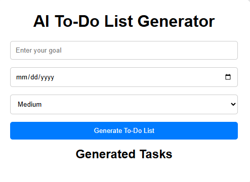
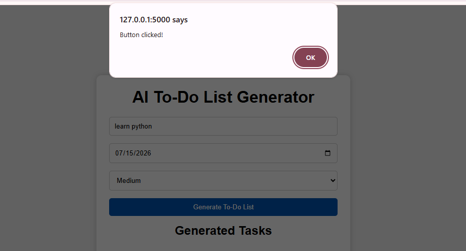
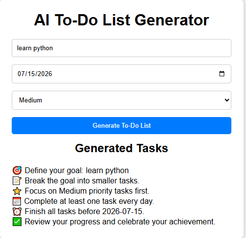

# AI To-Do List Generator

A Flask-based web application that generates a personalized to-do list based on a user's goal, deadline, and priority.

## Features
- Goal-based task generation
- Deadline management
- Priority selection
- Responsive user interface
- No API key required

## Technologies Used
- Python
- Flask
- HTML5
- CSS3
- JavaScript

Smart-ToDo-Generator/
├── app.py
├── requirements.txt
├── templates/
│   └── index.html
└── static/
    ├── style.css
    └── script.js
```

# ▶️ How to Run

1. Clone the repository

```
git clone https://github.com/cheruvulakshmikarreddy2010/AI-ToDo-Generator
```

2. Install dependencies

```
pip install -r requirements.txt
```

3. Run the application

```
python app.py
```

4. Open your browser

```
http://127.0.0.1:5000

## Future Improvements
- Save tasks using a database
- User authentication
- Task completion tracking
- AI-powered task generation

  ## Screenshots

## Screenshots









## Author
Lakshmikar Reddy Cheruvu
